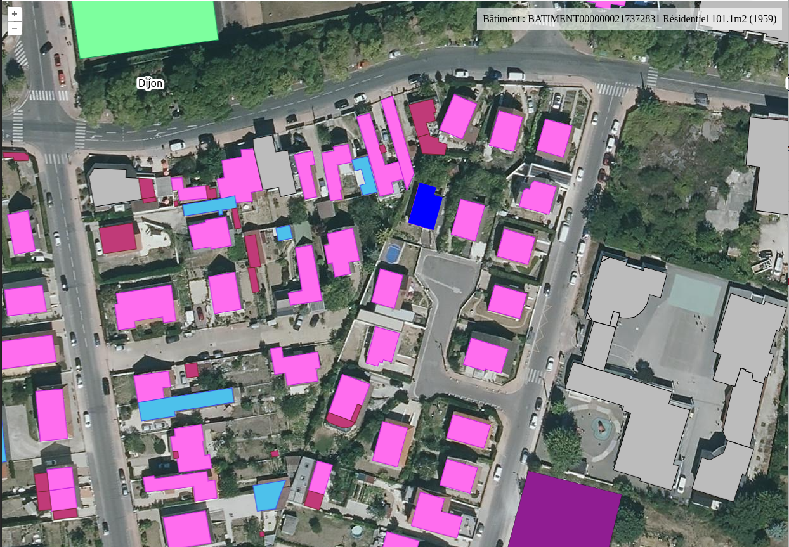

# Geoplateforme ol-mapbox-style

La carte est construite avec [Openlayers](https://openlayers.org/) et s'appuie sur la geoplateforme pour afficher un fond de plan Orthophotos avec le protocole WMTS, les bâtiments de la BDTOPO en tuilage vectoriel avec le protocole TMS / MVT et en interrogeant les bâtiments pour avoir la géométrie d'un bâtiment avec une requête `GetFeature` du prococole WFS.

L'extension [ol-mapbox-style](https://github.com/openlayers/ol-mapbox-style) est utilisée pour appliquer les styles définis par l'IGN pour la couche des BDTOPO, au format [Mapbox Style Specification](https://docs.mapbox.com/style-spec/guides/). Ils sont listés [ici](https://geoservices.ign.fr/documentation/services/api-et-services-ogc/tuiles-vectorielles-tmswmts/styles#39354) et c'est `bati` qui a été retenu.

L'application est compilée avec [Yarn](https://yarnpkg.com/) et [Vite](https://vitejs.dev/).

Une démonstration est disponible [ici](https://cvagner.github.io/geopf-ol-mapbox-style/).

.

## Développement

Installer les dépendances :
```sh
# Dernières versions
yarn

# Ou telles quelles
# yarn install --frozen-lockfile
```

Démarrer en local :
```sh
yarn start
```

Ouvrir http://localhost:5173/.

## Construction

Construire l'application et copier le jeu de données :
```sh
yarn build
```

Il s'agit ensuite de servir en HTTP le contenu du répertoire `dist`.
